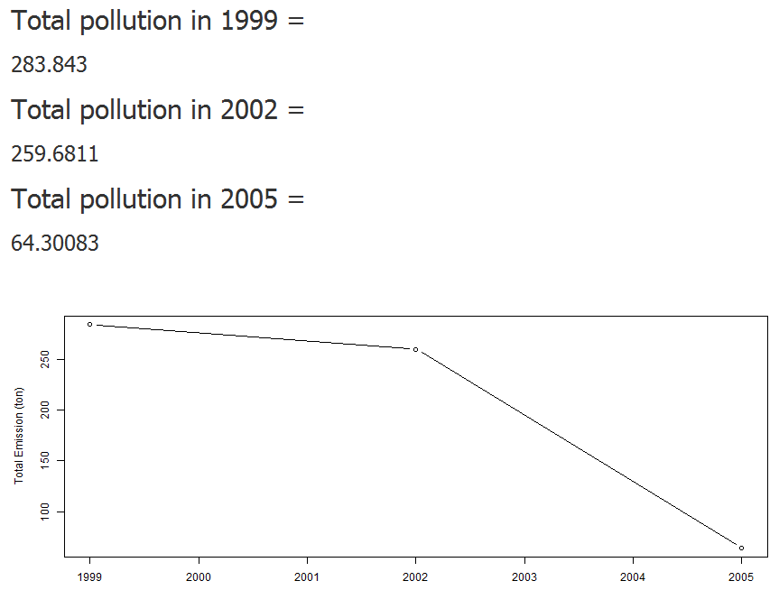

Air Pollution 1999-2005
========================================================
author: nursaadah
date: 24 January 2016

Dataset
========================================================

- Fine particulate matter (PM2.5) ambient air pollutant sample dataset from Environmental Protection Agency
- Being used in the Exploratory Data Analysis Course of Coursera
- Made some pre-processing to increase the speed of app

Column Type
========================================================

- fips: A five-digit number (represented as a string) indicating the U.S. country dataset from Environmental Protection Agency.
- Emissions: The emissions of different types in ton.
- type: The type of source. (point, non-point, on-road, or non-road)
- After the input of variable, press the process button to calculate the results

Results
========================================================

- fips: Input 5 digits of numbers based on the fips code. Reference site: http://www.epa.gov/enviro/html/codes/state.html. If you input the wrong code then the results will show 0.
- type: Choose the target type you want to select
- After the input of variable, press the process button to calculate the results

Sample results for 9003 fips
========================================================

